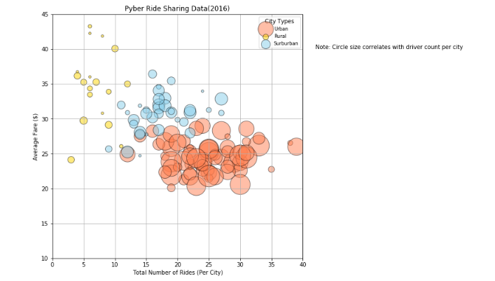
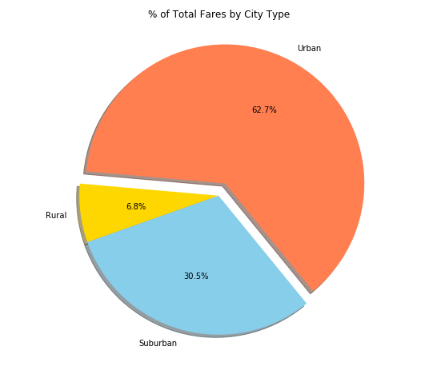
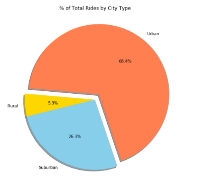
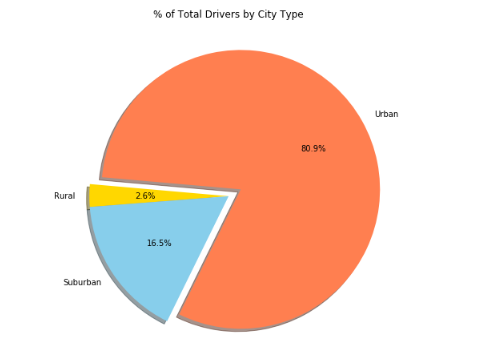

# Pyber
I completed this project during my time at the [Columbia Engineering Data Analytics Bootcamp](https://bootcamp.cvn.columbia.edu/data/nyc/landing/?s=Google-Brand&pkw=%2Bdata%20%2Banalytics%20%2Bcolumbia&pcrid=392444639754&pmt=b&utm_source=google&utm_medium=cpc&utm_campaign=%5BS%5D_GRD_Data_Brand_ALL_NYC_BMM_New&utm_term=%2Bdata%20%2Banalytics%20%2Bcolumbia&utm_content=392444639754&s=google&k=%2Bdata%20%2Banalytics%20%2Bcolumbia&gclid=Cj0KCQiA2b7uBRDsARIsAEE9XpFH-2wU0-_7jtxCV_PCkGBR0prlyKtvpF2-nAWU1tO4oYci5h1QStsaAsg5EALw_wcB&gclsrc=aw.ds) located in New York, NY.

#### -- Project Status: [Completed]

## Project Description

The purpose of this project is to analyze a ridesharing company's recordset of rides. The datasets contain information about every active driver and historic ride, including details like city, driver count, individual fares, and city type.

The final report includes each of the following:

### A Bubble Plot that showcases the relationship between four key variable: 
- Average Fare ($) Per City
- Total Number of Rides Per City
- Total Number of Drivers Per City
- City Type (Urban, Suburban, Rural)

### Three pie charts:
- % of Total Fares by City Type
- % of Total Rides by City Type
- % of Total Drivers by City Type

## Methods Used
* Data Visualization
* Data Analysis 
* Descriptive Analysis
* Data processing

## Technologies
* Python (Pandas, Numpy, Matplotlib, Jypyter Notebook)

## Getting Started

1. Clone this repository (for help see this [tutorial](https://help.github.com/articles/cloning-a-repository/)).
2. CSVs can be found in the [data](https://github.com/CarolineDelva/Pyber-Matplotlib-Project/tree/master/Pyber/data) in this repository.

3. The Python script is located in the [Pyber](https://github.com/CarolineDelva/Pyber-Matplotlib-Project/blob/master/Pyber/pyber%20script.ipynb) folder.
4. Run the script in a [Jupyter Notebook](https://jupyter.org/).

## Visualizations

### Pyber Ride Sharing Data(2016) Bubble Plot 

### Total Fares by City Type

### Total Rides by City Type

### Total Drivers by City Type

## Conclusion
-  Based on 'Pyber Ride Sharing Data(2016)' scatter plot, we see that Urban cities have the greatest number of drivers and rides, but they have lowest average fare. We see that suburban cities have an average number of drivers and rides and they have an average fare. We also see that rural cities have the smalest number of drivers and rides, but they have greatest average fare.

- Rides and drivers are not too avalaible in rural cities, which is making the fares more expensive. Rides and drivers are somewhat available in suburban cities, which is making the fares have an average rate. Rides and drivers are really available in urban cities, which is making the fares cheaper.

- The total ride percentage is the greatest in urban cities (68.4%), the total ride percentage is the second greatest in suburban cities (26.3%), and the total ride percentage is the lowest in rural cities (5.3%).

- The total drivers percentage is the greatest in urban cities (80.9%), the total drivers percentage is the second greatest in suburban cities (16.8%), and the total drivers percentage is the lowest in rural cities (2.6%). 

- Rides and drivers are not too avalaible in rural cities, which is making the fares more expensive. Rides and drivers are somewhat available in suburban cities, which is making the fares have an average rate. Rides and drivers are really available in urban cities, which is making the fares cheaper.

## Contact
* [Visit my LinkedIn](https://www.linkedin.com/in/caroline-delva-5184a172/) 
* [Visit my portfolio](https://carolinedelva.github.io/CarolineDelvaPortfolio/) 

